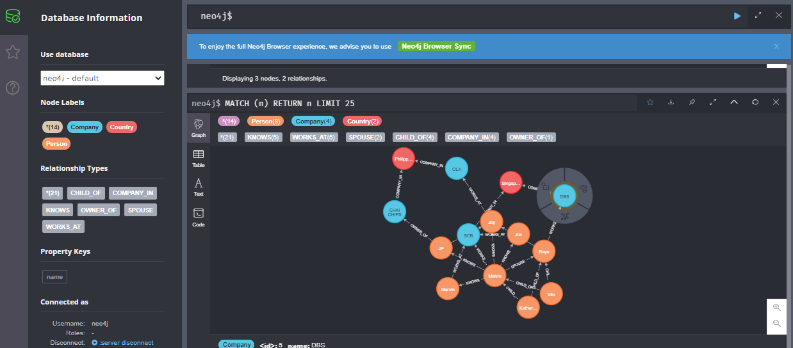
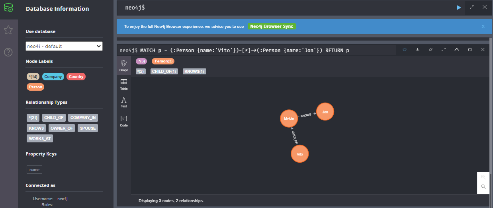

## Question 10.2
How would you design the data structures for a very large social network like Facebook or Linkedln? 

Describe how you would design an algorithm to show the connection, or path, between two people (e.g., Me -> Bob -> Susan -> Jason -> You).

## Solution

### Data Storage

* Relational DB
* Graph DB
* NoSQL

### Neo4j Tutorials

- [Neo4j with Docker](https://neo4j.com/developer/docker/)

```shell
$ docker run -p7474:7474 -p7687:7687 -e NEO4J_AUTH=neo4j/s3cr3t neo4j
```

- [My First Experience with Neo4J - running in Docker](https://www.melvinvivas.com/neo4j-in-docker/)



```sql
MATCH p = (:Person {name:'Vito'})-[*0..2]->(:Company {name:'DBS'})
RETURN p
```



## Solution (Text)

幅優先探索で探索していく. 2人のユーザは1段階のユーザ分しか離れていないかもしれないが、深さ優先探索では直近のノードを調べる前に数百万もある部分木を探索することになるかもしれないからである.

1. スタート時点のユーザのフレンドのID一覧を取得
2. フレンドのIDそれぞれに対して `machine_index = get_machine_id_for_user(person_id)`
3. マシンを移る
4. そのマシン上で `friend = get_person_with_id(person_id)` でフレンドのフレンドを取得.

```python
class Server:
    machines = []
    personToMachine = []
    def get_machine_with_id(self, machine_id) -> Machine:
        return
    def get_machine_id_for_user(self, person_id) -> int:
        return 
    def get_person_with_id(self, person_id) -> Person:
        return 
    
class Person:
    friend_ids = []
    person_id = 0
    def __init__(self, person_id):
        self.person_id = person_id
    def add_friend(self, friend_id):
        self.friend_ids.append(friend_id)

class Machine:
    persons = {}
    machine_id = 0
    def get_person_with_id(self, person_id):
        return self.persons.get(person_id)
    
```

