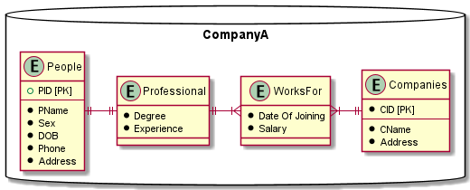
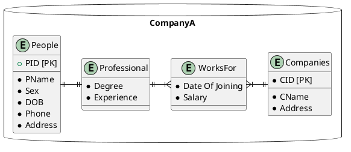

## Question 15.6

Draw an entity-relationship diagram for a database with companies, people, and professionals (people who work for companies).

## Solution

社員 = 人として考えることができるので、 People "is a" Worker となる。

People と 特徴・専門性（Professional) は "is a" の関係となる。

会社は多数の社員が所属するので、 People と Company の関係性は 1:N である。

WorksOf は Professional と Company をつなぐ中間テーブルで、就業開始日や給与を定義する。

